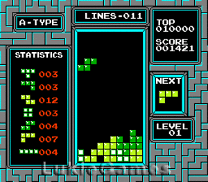

This tutorial uses React and Redux to recreate the classic arcade game Tetris.

Tetris is a classic arcade game that was originally designed and programmed by Russian game designer [Alexey Pajitnov](https://en.wikipedia.org/wiki/Alexey_Pajitnov). It was released on June 6, 1984.

The game, or one of its many variants, is available for nearly every video game console and computer operating system, as well as on devices such as graphing calculators, mobile phones, portable media players, PDAs, Network music players and as an Easter egg on non-media products like oscilloscopes.

Here is what Tetris looked like on an arcade machine in the 80s.



Here is what we will build with this tutorial. This version of Tetris will run in any web browser that supports JavaScript.


# Why is this important?

Completing this project will give you a chance to practice creating advanced front end applications with React. It will also give you an opportunity to look at managing complex appication satte with Redux. Beyond all of this the tutorial uses complex Objects and Arrays. This should give you new tools to practice your JavaScript skills.

# Prerequisites

To complete this tutorial you should have some experience with the JavaScript Language and React. This tutorial covers some more advanced topics in React and Redux, so if this is completely new to you, we suggest completing the [timers app tutorial](https://www.makeschool.com/academy/track/react-redux-passwords-app-tutorial-oh4) first.

Some experience working with the command line, including NPM and Node, is also required.

# Overview

The goal of the project is to recreate the classic arcade game Tetris with React and Redux.

React will generate and manage the views in the project while the state of the game will be stored in Redux.

The game is controlled by a nested array that represents the grid containing all of the blocks.

The tutorial will also delve into related topics like CSS, CSS Grid, and Flex Box.

# Learning Outcomes

By the end of this tutorial, students should be able to...

1. Implement an advanced single page application with React
1. Use Redux to manage application state
1. Build systems that manage and merge complex arrays
1. Use functional programming methods like `map`
1. Use CSS variables
1. Create complex layouts with CSS grid

# Technical Planning

We're going to build this game up component by component, then implement our actions and reducers, and tie it all together. We'll also be styling as we go along as well. At a high level, here's our plan to follow:

1. Implement the overall grid square
1. Implement the game board
1. Implement the "next block" area
1. Implement the score board
1. Arrange the layout of the game
1. Implement the controls
1. Implement the message popup
1. Implement the actions and reducers
1. Do some code organizing and cleanup
1. Implement state and shapes
1. Connect each component up to state and reducers
1. Implement block rotation
1. Implement moving blocks
1. Building a timer system
1. Implementing Game Over and Restart

# Using Git/GitHub

Much like we've done in earlier tutorials, make sure you're committing your code as you complete milestones. At a minimum, you should make a commit whenever the tutorial prompts you.

## Set Up Git/GitHub

Set up your repo!

>[action]
> Make your first commit
>
```bash
$ git init
$ git add .
$ git commit -m 'project init'
```

Now go to GitHub and create a public repository called REPO-NAME, and now associate it as a remote for your local git project and then push to it.

>[action]
> Push it!
>
```bash
$ git remote add origin GITHUB-REPO-URL
$ git push origin main -u
```

# Create a default app

First thing we need to do is get our default React app set up

> [action]
>
> Create a default app using Create React App. You can follow the instructions [here](https://github.com/facebook/create-react-app).
>
> Test your app with: `npm start` or `yarn start` to make sure everything is working.

You can visit the project in a browser at `http://localhost:3000/`. It should open at the this address automatically. If all went well, you should see the below in your browser:


# Clean up the Default Project

Clean up the default project by removing the header and default
content.

> [action]
>
> In `/src/App.js` edit the `render` method to provide the following JSX:
>
```js
function App() {
  return (
    <div className="App">
      <header className="App-header">
        <h1 className="App-title">Tetris Redux</h1>
      </header>
    </div>
  );
}
```
>
> Since we removed the logo we should remove the import for it:
> remove the `import logo from './logo.svg';` line from the top of `/src/App.js`
>
> Lastly, make a folder for components: `src/components`

# Test the changes

With the server running any changes you make to the code should
trigger the server to refresh automatically. You should now see the below in the browser:


# Adding Dependancies

Redux is a library that manages Application state. The React-Redux library acts as bindings between React and Redux. We will need to install both as dependancies.


> [action]
>
> Add Redux and React-Redux as a dependency to your project.
>
```bash
$ npm install --save redux react-redux
```

# Add some folders

This next step adds a couple folders to organize your code.

> [action]
>
> Make a folder for Actions: `src/actions`
>
> Then, make a folder for Reducers: `src/reducers`
>
> Finally, make another folder to hold some utility functions: `src/utils`

# Now Commit

>[action]
>
```bash
$ git add .
$ git commit -m 'proj setup complete'
$ git push
```


## Resources

- [React](https://reactjs.org)
- [Redux](https://redux.js.org)
- [npm](https://www.npmjs.com)
- [Node JS](https://nodejs.org/en/)
- https://github.com/facebook/create-react-app
- https://github.com/reduxjs/redux
- https://github.com/reduxjs/react-redux
