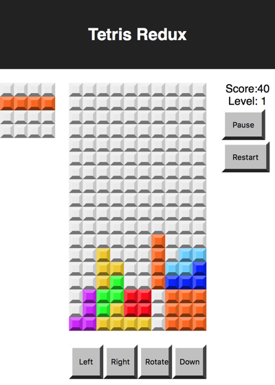

This tutorial uses React and Redux to recreate the classic
arcade game Tetris.

Tetris is a classic arcade game that was originally designed
and programmed by Russian game designer [Alexey Pajitnov](https://en.wikipedia.org/wiki/Alexey_Pajitnov).
It was released on June 6, 1984.

The game, or one of its many variants, is available for nearly
every video game console and computer operating system, as well
as on devices such as graphing calculators, mobile phones,
portable media players, PDAs, Network music players and as an
Easter egg on non-media products like oscilloscopes.

Here is what Tetris looked like on an arcade machine in the
80s.


Here is what we will build with this tutorial. This version of
Tetris will run in any web browser that supports JavaScript.



# Prerequisites

To complete this tutorial you should have some experience with
the JavaScript Language and React by completing the [timers app tutorial](https://www.makeschool.com/academy/track/react-redux-passwords-app-tutorial-oh4)

Some experience working with the command line, including NPM
and Node.

# Introduction

The goal of the project is to recreate the classic arcade game
Tetris with React and Redux.

React will generate and manage the views in the project while
the state of the game will be stored in Redux.

The game is controlled by a nested array that represents the
grid containing all of the blocks.

The tutorial will also delve into related topics like CSS,
CSS Grid, and Flex Box.

# Concepts Covered

Tetris is a fun and interesting game that can be reacted with
arrays. This tutorial will store those arrays and other
information and manage changes with Redux.

The game will use React to display the data stored in Redux to
render the game in the browser.

The tutorial will also use some advanced CSS techniques like
CSS Grid and Flex Box to render elements in the browser.

The project will manage software dependancies with npm and node.

## Resources

- [React](https://reactjs.org)
- [Redux](https://redux.js.org)
- [npm](https://www.npmjs.com)
- [Node JS](https://nodejs.org/en/)

# Using Git/GitHub

Much like we've done in earlier tutorials, make sure you're committing your code as you complete milestones. At a minimum, you should make a commit whenever the tutorial prompts you.

## Set Up Git/GitHub

Set up your repo!

>[action]
> Make your first commit
>
```bash
$ git init
$ git add .
$ git commit -m 'project init'
```

Now go to GitHub and create a public repository called REPO-NAME, and now associate it as a remote for your local git project and then push to it.

>[action]
> Push it!
>
```bash
$ git remote add origin GITHUB-REPO-URL
$ git push origin master -u
```
