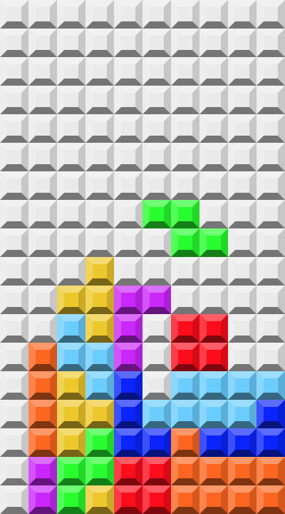

This section takes the grid square created in the last 
section and displays them as a 10 x 18 grid. 
This grid of squares will be a component. 



# Introduction 

The the main view of the game is made of a 10 by 18 grid. 
Where each square on the grid is a single 20px by 20px square 
rendered from a grid square component. 

The main game logic has not been implmented yet so you 
will hard code the grid squares for now. 

The grid is made up of is an array containing 18 arrays. 
Each of these arrays represent one row on the grid. 

Each row is an array containing 10 integers. Each each 
integer represents the color displayed at that row and column. 

This a to dimensional array. You might visualize it like this: 


## Challenges

**Make the GridBoard Component**

Make a new file: 'src/components/grid-board.js'. 

```jsx
import React, { Component } from 'react'
import GridSquare from './grid-square'

// Represents a 10 x 18 grid of grid squares

class GridBoard extends Component {

  makeGrid() {
    const grid = []
    for (let row = 0; row < 18; row ++) {
      grid.push([])
      for (let col = 0; col < 10; col ++) {
        grid[row].push(<GridSquare key={`${col}${row}`} color="1" />)
      }
    }

    return grid
  }

  render () {
    return (
      <div classname='grid-board'>
        {this.makeGrid()}
      </div>
    )
  }
}

export default GridBoard
```

The `makeGrid` method generates an array of 18 rows, 
each containg 10 `GridSquares`. 

The components in this array are rendered in `div.grid-board`.

Test this in 'App.js'.

The grid squares should all end up stacked vertically. 

**Use CSS Grid to arrange the squares**

Use CSS Grid to arrange them into a grid. 

Add the following your stylesheet. 

```css
* {
  box-sizing: border-box;
}

/* Grid Board */
.grid-board {
  display: grid;
  grid-template-columns: repeat(var(--cols), var(--tile-size));
  grid-gap: 0;
  align-self: flex-start;
}
```

The first rule sets the `box-sizing` to `border-box`
This has the effect of telling the browser to calculate the 
size boxes to inlcude the border width rather than adding
the border, which is the default. Read more about the [CSS Box Model](https://developer.mozilla.org/en-US/docs/Web/CSS/CSS_Box_Model/Introduction_to_the_CSS_box_model).

The second rule defines the `grid-board` to display as `grid`.
This causes the children of this element to arrange on a grid. 
The number of columns is set by `--cols` var and the width 
of each column is set by `--tile-size`. These two CSS custom 
properties are defined in `:root` which allow them to be easily 
changed. 

## conclusion 

Here you created a new component to display the game board grid. 
This component contains 10x18 grid squares, which are arranged 
in a grid with the help of CSS Grid. 

## Resources

- https://www.w3schools.com/css/css_grid.asp
- https://developer.mozilla.org/en-US/docs/Web/CSS/CSS_Box_Model/Introduction_to_the_CSS_box_model
