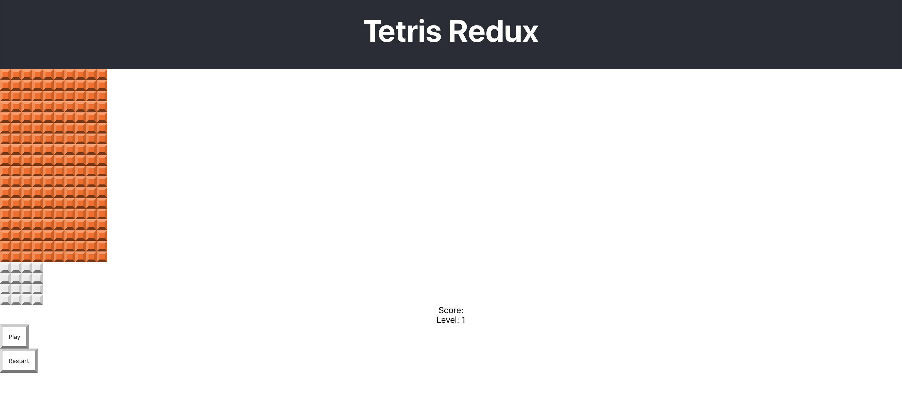

1. ~~Implement the overall grid square~~
1. ~~Implement the game board~~
1. ~~Implement the "next block" area~~
1. **Implement the score board**
    1. **Create the score board component with restart and play/resume buttons**
    1. **Style the component**
    1. **Add to `App.js`**
1. Arrange the layout of the game
1. Implement the controls
1. Implement the message popup
1. Implement the actions and reducers
1. Do some code organizing and cleanup
1. Implement state and shapes
1. Connect each component up to state and reducers
1. Implement block rotation
1. Implement moving blocks
1. Building a timer system
1. Implementing Game Over and Restart

We need a score board to show the game score and
provide a place for the play and pause buttons
to live.

The scoreboard when completed will display on the
right side of the game board.


Some requirements for the score board:

- The score board component will display the game score.
- As blocks are placed when a row is filled with colored squares, the game scores points.
- The game also needs a button to pause game play and restart the game.
- As the game progresses you can speed up game play or make it
more difficult in other ways for the current level.
- The component added in this chapter will give these previously described elements a place to live.


# Create the ScoreBoard Component

> [action]
>
> Make a new file: `/src/components/score-board.js` with the following code:
>
```js
import React, { Component } from 'react'
class ScoreBoard extends Component {
  render() {
    return (
      <div className="score-board">
        <div>Score:{ this.props.score }</div>
        <div>Level: 1</div>
        <button className="score-board-button" onClick={(e) => {
        }}>Play</button>
        <button className="score-board-button" onClick={(e) => {
        }}>Restart</button>
      </div>
    )
  }
}
export default ScoreBoard
```

Now we can define some styles for these elements. No need to worry about
the text, we'll just focus on the buttons for now.

> [action]
>
> Add the following to `/src/index.css`
>
```css
/* Score Board */
.score-board-button {
  display: block;
  padding: 1em;
  border-width: 5px;
  border-top-color: var(--button-color-t);
  border-left-color: var(--button-color-l);
  border-right-color: var(--button-color-r);
  border-bottom-color: var(--button-color-b);
}
```

Notice we used the CSS variables again!

# Add to App.js

Let's see what we have so far:

> [action]
>
> Add the following to `/src/App.js`:
>
```js
import React, { Component } from 'react';
import GridBoard from './components/grid-board'
import NextBlock from './components/next-block'
[bold]import ScoreBoard from './components/score-board'[/bold]
import './App.css';
class App extends Component {
  render() {
    return (
      <div className="App">
        <header className="App-header">
          <h1 className="App-title">Tetris Redux</h1>
        </header>
        <GridBoard />
        <NextBlock />
[bold]        <ScoreBoard />[/bold]
      </div>
    );
  }
}
export default App;
```

# Product So Far

You should see the following in your browser:



This needs work, but we will take care the details later. For now this is a solid start, and we got more practice **working with CSS variables!**

# Now Commit

>[action]
>
```bash
$ git add .
$ git commit -m 'Added initial score board'
$ git push
```
