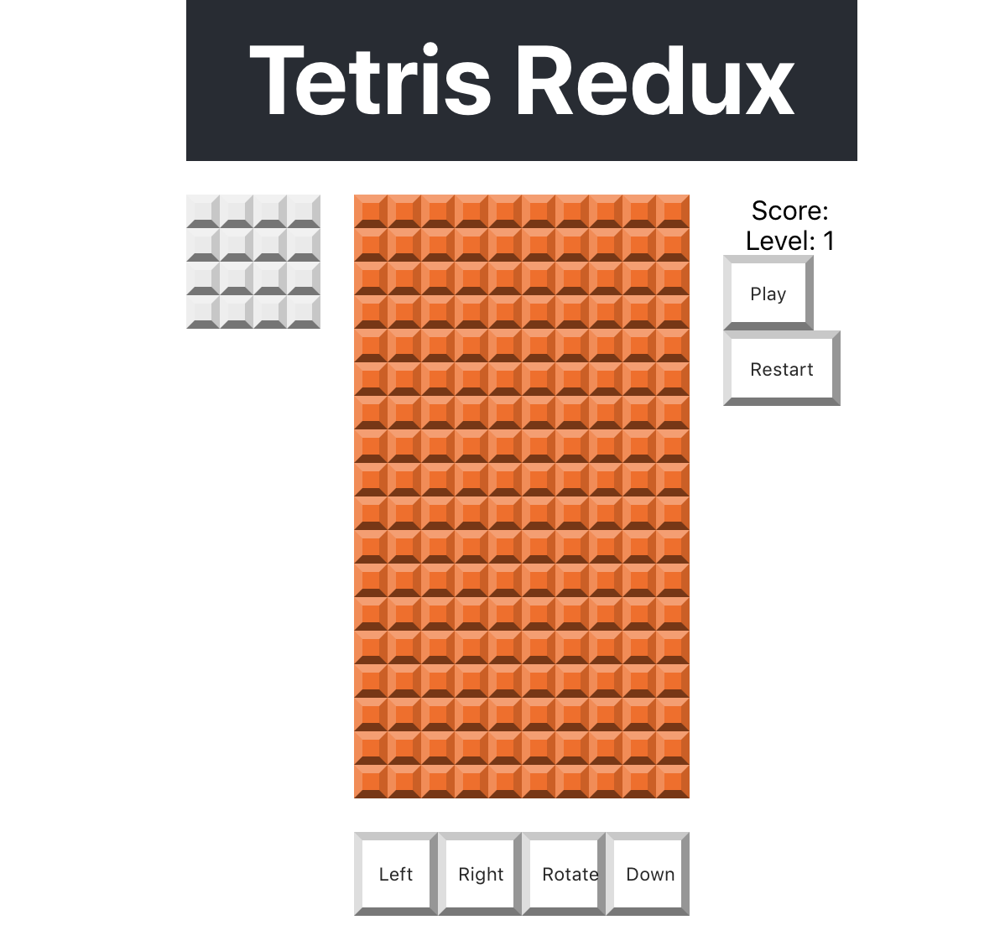

1. ~~Implement the overall grid square~~
1. ~~Implement the game board~~
1. ~~Implement the "next block" area~~
1. ~~Implement the score board~~
1. ~~Arrange the layout of the game~~
1. **Implement the controls**
    1. **Build out the Left, Right, Rotate, and Down controls**
    1. **Style the controls**
    1. **Add the controls to `App.js`**
1. Implement the message popup
1. Implement the actions and reducers
1. Do some code organizing and cleanup
1. Implement state and shapes
1. Connect each component up to state and reducers
1. Implement block rotation
1. Implement moving blocks
1. Building a timer system
1. Implementing Game Over and Restart

Tetris has a couple controls. Blocks can be moved left, right, and down. They can also be rotated.

The original game used a joystick and button. This game will use four buttons.


The next step is to create a component with four buttons. These buttons will all issue actions.

Redux allows you to make changes to application state from any component by issuing an action.

Without Redux, changes in state would have to be passed up and down the component hierarchy and state would have to be managed by a shared parent component.

# Adding Controls

The first step is to make a new component to hold the buttons.

> [action]
>
> Make a new file `/src/components/Controls.js` that contains the following stub code for the controls component class (we'll build this out later):
>
```JS
import React from 'react'
>
export default function Controls(props) {
	return (
		<div className="controls">
			{/* left */}
			<button className="control-button" onClick={(e) => {
>
			}}>Left</button>
>
			{/* right */}
			<button className="control-button" onClick={(e) => {
>
			}}>Right</button>
>
			{/* rotate */}
			<button className="control-button" onClick={(e) => {
>
			}}>Rotate</button>
>
			{/* down */}
			<button className="control-button" onClick={(e) => {
>
			}}>Down</button>
>
		</div>
	)
}
```

# Style the Controls

Add some styles to the controls container. Notice here we are mapping this element to grid area "b".

> [action]
>
> Add some new styles for the controls in `/src/index.css`
>
```CSS
/* controls */
.controls {
  grid-area: b;
  display: flex;
  flex-direction: row;
}
```

The controls container will use the [Flex Box](https://developer.mozilla.org/en-US/docs/Learn/CSS/CSS_layout/Flexbox) for layout.

Flex Box implements is a one dimensional layout. All of the buttons in the controls container are arranged in a horizontal row along a single axis.


> [action]
>
> Define some styles for the control buttons in `/src/index.css`
>
> We want the buttons to be square with a width of 25% of grid board. The grid is 10 tiles wide, so the size of the buttons should be (2.5 * tile size)
>
```CSS
/* Control Button */
.control-button {
  --size: calc(var(--tile-size) * 2.5);
  width: var(--size);
  height: var(--size);
  text-align: center;
  display: block;
  border-width: 5px;
  border-top-color: var(--button-color-t);
  border-left-color: var(--button-color-l);
  border-right-color: var(--button-color-r);
  border-bottom-color: var(--button-color-b);
}
```

# Add to App.js

Let's add our controls into our app!

> [action]
>
> Add the following to `/src/App.js`:
>
```js
import React from 'react';
import './App.css';
>
import GridBoard from './components/GridBoard'
import NextBlock from './components/NextBlock'
import ScoreBoard from './components/ScoreBoard'
import Controls from './components/Controls'
>
function App() {
  return (
    <div className="App">
      <header className="App-header">
        <h1 className="App-title">Tetris Redux</h1>
      </header>
      <GridBoard />
      <NextBlock />
      <ScoreBoard />
      <Controls />
    </div>
  );
}
```

# Product So Far

You should see the following in your browser:



Obviously these controls don't do anything yet, but we'll build them out in a future chapter

# Now Commit

>[action]
>
```bash
$ git add .
$ git commit -m 'Added initial controls'
$ git push
```
