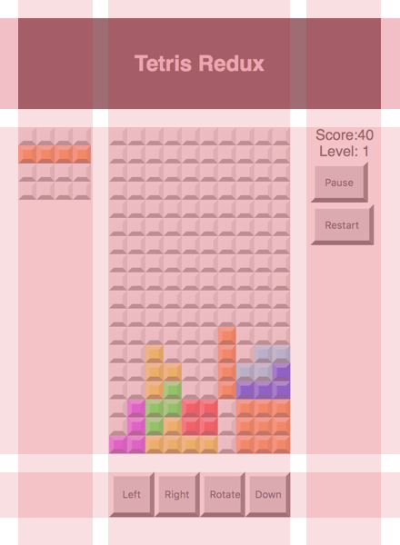
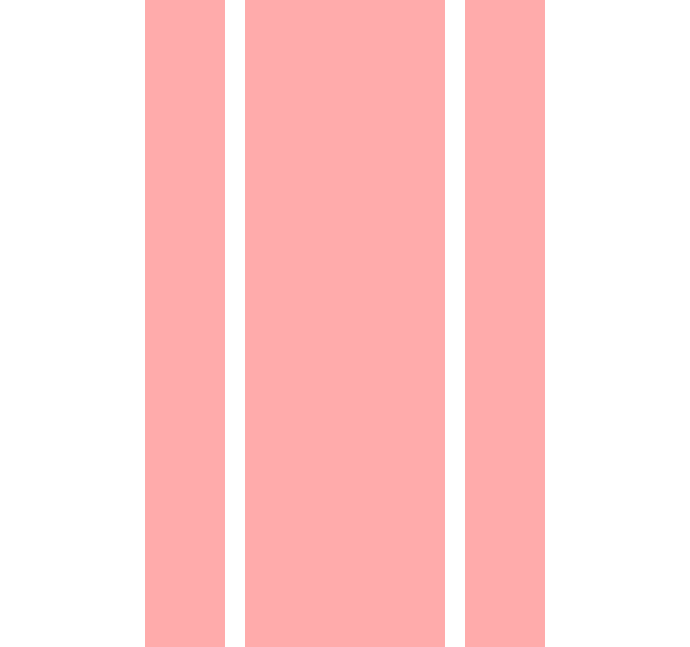
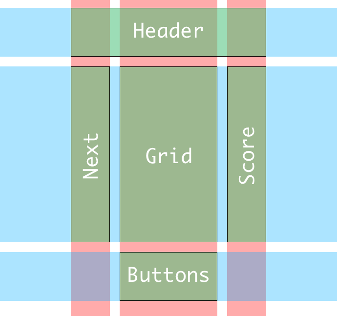

Arranging the large UI elements on the page will
make the app easier to understand and look better.

The components are on a grid.



CSS grid is good for arranging the tiles in the
grid. CSS grid can also be used to arrange the
larger UI element on the page as a whole.

CSS Grid gives you control to arrange elements on
a two dimensional grid. Elements can occupy multiple
rows and/or columns. All of this is easily accomplished
using a simple declarative approach.

> [info]
>
> A grid is a two dimensional structure of columns and rows.
Columns span vertically and rows span horizontally.
In CSS we define the number of rows and columns, and the
width of each column and the height of each row.
>
> The size of a column or row can be defined in any unit
supported by CSS: `%`, `px`, `em`, `pt`, `mm`, `in`, cm etc.
Columns and rows can also also be specified as a fraction
of the available space with special unit: `fr`.
>
> The CSS grid module provides properties that allow you
to define the configuration of the grid many different
ways. This discussion will focus on Grid Areas. Grid Areas
are named collections of cells on the grid.

# Defining a grid for the game

For the Tetris game the grid might have three columns and three rows. This layout includes the Header, NextBlock, GridBoard, ScoreBoard, Buttons components.

Let's define some requirements for this grid:

## Column Requirements

- The Header will span all of the columns along the top.
- The NextBlock, GridBoard, and ScoreBoard will be side by side each taking a column.
- The Buttons will sit in the center column below the GridBoard.
- The size of the columns can be based on the size of the game tiles (20px).
- The columns will be 80px (20px * 4 columns), 200px (20px * 10 columns), and 80px



## Row Requirements

- There will be three rows.
The top will 100px this will contain the Header.
- The center row will be sized to fit the game grid 360px (20px * 18) -- The bottom row will hold the buttons (which haven't been made yet) 100px.


## Columns + Rows

Put these together and they look like this:


The intersection of Columns and Rows makes the **Grid Cells**.


CSS Grid allows you to define **Grid Areas** that span
multiple Columns and Rows.

**The goal of the final layout is to place the header across
the top three columns.**



The image shows 5 areas defined.

- **Header:** displays the title
- **Next:** Shows the next block
- **Grid:** Shows the game grid
- **Score:** Shows the game score
- **Buttons:** Shows the game buttons

Notice the cells in the lower left and right corner are
not being used.

The gap between cells is an option that can be set with
CSS Grid. We will make that the same size as one grid square.

# App Grid Style

Now that we have a better sense of how grids work, let's define some styles to declare the main app container as a grid. This will layout it's children as grid items.

Currently the app structure looks looks like this:  

- div.App
  - header.App-header
  - div.grid-board
  - div.next-block
  - div.score-board

We will declare `.App` as a grid container and define some grid areas.
The areas are just strings, and we'll use the following names to represent the areas:

- h : Header
- l : Left
- c : Center
- r : Right
- b : Buttons
- . : Is used to mark an empty cell

> [action]
>
> Add the following to `/src/index.css`:
>
```CSS
/* App */
.App {
  --col-side: calc(var(--tile-size) * 4);
  --col-center: calc(var(--tile-size) * 10);
  --grid-height: calc(var(--tile-size) * 18);
>
  width: calc(var(--tile-size) * (4 + 1 + 10 + 1 + 4));
  margin: auto;
  display: grid;
>
  grid-gap: var(--tile-size) var(--tile-size);
  /* Defines three columns of `--col-side`, `--col-center`, and `--col-side` widths. */
  grid-template-columns: var(--col-side) var(--col-center) var(--col-side);
  /* Defines three rows of `100px`, `--grid-height`, and 100px. */
  grid-template-rows: 100px var(--grid-height) 100px;
>
/* This defines the areas on the grid with names: 'h', 'l', 'c', 'r',
and 'b'. The '.' represents an empty cell on the grid. */
  grid-template-areas: "h h h"
                       "l c r"
                       ". b .";
}
```

Now let's assign child elements to grid areas in the parent.

> [action]
>
> Assign the header a grid area by adding the following to `/src/index.css`
>
```CSS
/* App-header */
.App-header {
  grid-area: h;
}
```

Let's edit some of the previous styles we made to include the `grid-area`

> [action]
>
> Add the last line to the `.next-block` rule in `/src/index.css`:
>
```CSS
/* Next Block */
.next-block {
  display: grid;
  grid-template-columns: repeat(4, var(--tile-size));
  align-self: flex-start;
[bold]  grid-area: l; /* Grid area l left column */[/bold]
}
```
>
> Add the last line to the `.grid-board` rule in `/src/index.css`:
>
```CSS
/* Grid Board */
.grid-board {
  display: grid;
  grid-template-columns: repeat(var(--cols), var(--tile-size));
  grid-gap: 0;
  align-self: flex-start;
[bold]  grid-area: c; /* Assign to grid area c */[/bold]
}
```
>
> Finally, add assign a `grid-area` for `.score-board` in `/src/index.css`:
>
```CSS
/* score-board */
.score-board {
  grid-area: r;
}
```

Check out your browser now, sure looks a lot better than before!


## Conclusion

This step used CSS Grid to layout the major UI element blocks.
Using `grid-area` makes the the process easier manage.

You used variables to define the width of UI blocks based on the
size of the grid squares. This way changing the size of the grid
square will change the size of everything.

## Resources

- https://developer.mozilla.org/en-US/docs/Web/CSS/grid-template-areas

# Now Commit

>[action]
>
```bash
$ git add .
$ git commit -m 'Added grid area styles'
$ git push
```
