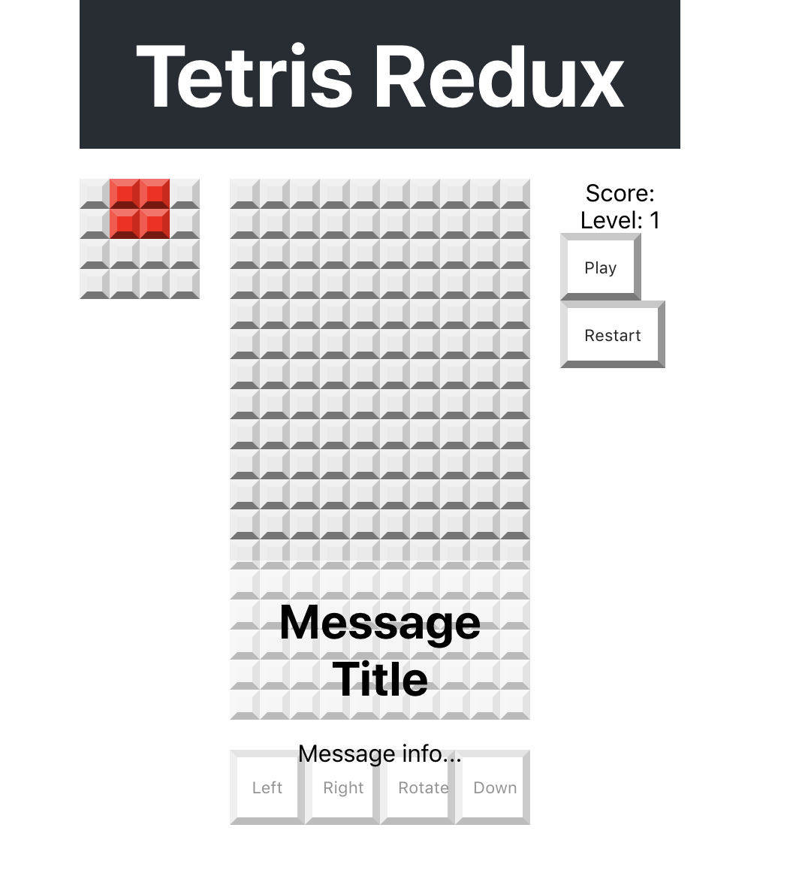

1. ~~Implement the overall grid square~~
1. ~~Implement the game board~~
1. ~~Implement the "next block" area~~
1. ~~Implement the score board~~
1. ~~Arrange the layout of the game~~
1. ~~Implement the controls~~
1. ~~Implement the message popup~~
1. ~~Implement the actions and reducers~~
1. ~~Do some code organizing and cleanup~~
1. ~~Implement state and shapes~~
1. **Connect each component up to state and reducers**
    1. **NextBlock**
        1. **Set the `state` to `defaultState` in `game-reducer`**
        1. **Connect the `next-block` component**
        1. **Implement the `mapStateToProps` function**
        1. **Build out the next block grid to show shapes**
1. Implement block rotation
1. Implement moving blocks
1. Building a timer system
1. Implementing Game Over and Restart

Tetris displays the next block in the upper left corner.
This is a component that will display a 4 by 4 grid
of square components.


With the default game state defined it's time to connect
game state to components.

The goal for this chapter is to display the next block in the NextBlock component. To do this you need to get the _index_ of the next block
from game state and _map_ this to an array of squares in
the component.

The index of the next block is stored at `game.nextShape`
on `state`. Use this to find the array that represents this
shape, at the first rotation, and map it to the grid.

The empty grid will be:

`const box = shapes[0][0]`

Remember the first block is empty. The shape would be
located at:

`const block = shapes[shape][0]`

The color of the square will match the index of the shape.

To get state from Redux into this Component you'll
need to connect the component with React-Redux.

# Set the Default State

First thing we need to do is set our `state` properly. Remember when we set `state = {}` in `/src/reducers/game-reducer.js`? We're not going to be able to track any state or props if we're always setting it to empty!

Luckily we built that `defaultState` function in `/utils`. Time to use it!

> [action]
>
> Import the `defaultState` function into `/src/reducers/game-reducer.js`, and then update `state` in the `gameReducer` const to the following:
>
```js
import { defaultState } from '../utils'
>
const gameReducer = (state = defaultState(), action) => {
>
...
>
}
```

# Import connect

First step is we need to connect the component to Redux.

> [action]
> Add the following import near the top of `/src/components/next-block.js`:
>
```js
import { connect } from 'react-redux'
```

# Map State to Props

We'll need to get the data from `state` and map it to `props` in this component.

> [action]
>
> Map the `nextShape` from `state.game` to `shape` by adding the React-Redux helper method `mapStateToProps` in `/src/components/next-block.js`:

```JavaScript
// Map State to props
const mapStateToProps = (state) => {
  return {
    // Return nextShape as shape
    shape: state.game.nextShape
  }
}
```

# Connect component

Let's connect this component up to Redux:

> [action]
>
> Replace the `export` line at the bottom of `/src/components/next-block.js` with the following:
>
```js
export default connect(mapStateToProps)(NextBlock)
```

_Now you can use data mapped to props_. The `shape` key on props now holds the index of the shape to display.

# Map the block shape into the grid

Finally, we need to transform one of the shape arrays into `GridSquare`s. The color of each square will be the shape index.

Working with the shapes array from `utils`, `shape[index]` will give an array containing all rotations for a shape. Here we will just display the first rotation. So `shape[index][0]` should give a two dimensional array with four rows and four columns that describe the shape.

Once we've got the shape array we'll need to transform it into `GridSquares`

> [action]
>
> Add an import for `shapes` and then update the `makeGrid` function in `/src/components/next-block.js` to the following
>
```JavaScript
...
import { shapes } from '../utils'
...
makeGrid() {
  // deconstruct shape
  const { shape } = this.props
  // get the array for this shape first rotation
  const block = shapes[shape][0]
  // get the empty shape
  const box = shapes[0][0]        
>
  // Map the block to the grid
  return box.map((rowArray, row) => {
    return rowArray.map((square, col) => {
      // If there is a 1 use the shape index
      const color = block[row][col] === 0 ? 0 : shape
      return <GridSquare key={`${row}${col}`} color={color} />
    })
  })
}
```

Refresh the browser to see a different shape/orientation appear in the Next Block area!



# Now Commit

>[action]
>
```bash
$ git add .
$ git commit -m 'Added connection for next block'
$ git push
```
