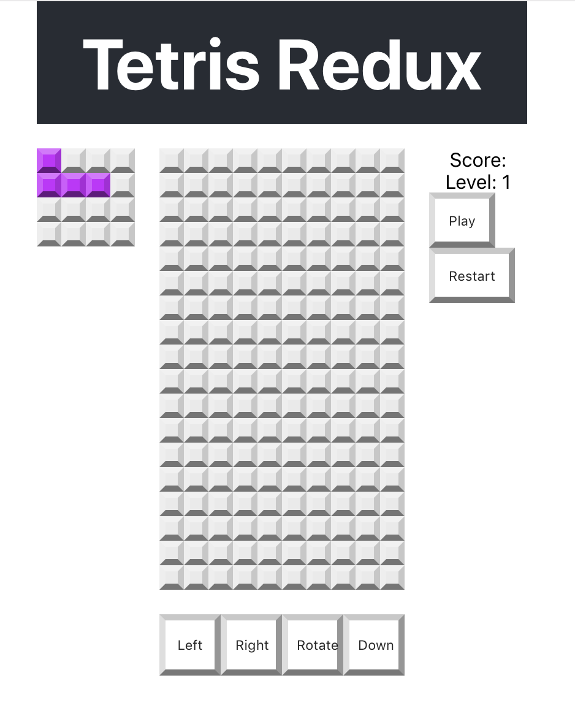

1. ~~Implement the overall grid square~~
1. ~~Implement the game board~~
1. ~~Implement the "next block" area~~
1. ~~Implement the score board~~
1. ~~Arrange the layout of the game~~
1. ~~Implement the controls~~
1. ~~Implement the message popup~~
1. ~~Implement the actions and reducers~~
1. ~~Do some code organizing and cleanup~~
1. ~~Implement state and shapes~~
1. **Connect each component up to state and reducers**
    1. ~~NextBlock~~
    1. ~~GridBoard~~
    1. ~~Controls~~
    1. **Message-Popup**
        1. **Implement the `mapStateToProps` function**
        1. **Implement the `mapDispatchToProps` function**
        1. **Connect the `message-popup` component**
        1. **Update the `render` method to display the appropriate text based on the state of the game**
1. Implement block rotation
1. Implement moving blocks
1. Building a timer system
1. Implementing Game Over and Restart

Time for the message popup to connect to `state`! This will allow us to show the message popup when the game changes state, such as when the game is paused or ends.

We want the message popup should display when the game is paused or over. Otherwise it will be invisible. Remember we're using CSS to control the position and visibility.

Currently the popup displays all the time. We can fix this in two steps:

1. Retrieve the `isRunning` and `gameOver` properties from `state`
1. Use them to display or hide the popup by adding or removing a CSS class name to the component's parent element!

# Import Connect, mapStateToProps, mapDispatchToProps

Time to do the usual connection set up. For this one, try it yourself first before checking with the solution. Here are some guidelines:

- Map the `isRunning` and `gameOver` properties from state to props in the `mapStateToProps` function.
- Define the `mapDispatchToProps` function to return an empty object. We won't use this here, but we can stub it in for future use.
- Remember to connect the component with props and dispatch

> [solution]
>
> Updated `/src/components/message-popup.js`:
>
```js
import React, { Component } from 'react'
import { connect } from 'react-redux'
>
// Displays a message
class MessagePopup extends Component {
>
    render() {
      return (
        <div className='message-popup'>
          <h1>Message Title</h1>
          <p>Message info...</p>
        </div>
      )
    }
}
>
const mapStateToProps = (state) => {
  return {
    gameOver: state.game.gameOver,
    isRunning: state.game.isRunning
  }
}
>
const mapDispatchToProps = () => {
  return { }
}
>
export default connect(mapStateToProps, mapDispatchToProps())(MessagePopup)
```

# Hide and show the MessagePopup

Use the following logic to hide and show the message popup.

- If `isRunning` and `gameOver` is `false` the message popup
should be hidden. Hide it by adding the `hidden` class to
`className`.
- If `isRunning` is `false` the message popup should be visible
and the message text should say 'Paused'.
- If `gameOver` is `true` the message popup should be visible
and the message text should say 'Game Over'.

Again, try this on your own, and then check against the solution to see how well you matched up.

> [solution]
>
> Updated `render` method in `/src/components/message-popup.js`:
>
```js
render() {
    const { gameOver, isRunning } = this.props
    let message = ''
    let isHidden = 'hidden'
>
    // If the game is over, show the popup saying "Game Over"
    if (gameOver) {
      message = 'Game Over'
      isHidden = ''
    // If the game isn't running, it must be paused, so show the popup saying "Paused"
    } else if (!isRunning) {
      message = 'Paused'
      isHidden = ''
    // Default message, will still be hidden
    } else {
      message = '???'
    }
>
    return (
      <div className={`message-popup ${isHidden}`}>
        <h1>{message}</h1>
        <p></p>
      </div>
    )
}
```

# Product So Far

Refresh the browser to see the popup should now be hidden! Our Message Popup now **uses Redux/Flux to manage application state!**



# Now Commit

>[action]
>
```bash
$ git add .
$ git commit -m 'Added connection for message popup'
$ git push
```
