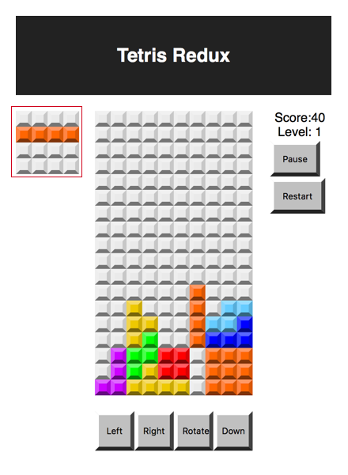

Tetris displays the next block in the upper left corner. 
This is a component that will display a 4 by 4 grid 
of square components. 



# Introduction 

With the default game state defined it's time to connect 
game state to components. 

The goal is to display the next block in the NextBlock 
component. 

To do this you need to get the index of the next block 
from game state and map this to an array of squares in
the component.

The index of the next block is stored at `game.nextShape` 
on state. Use this to find the array that represents this 
shape, at the first rotation, and map it to the grid. 

The empty grid will be: 

`const box = shapes[0][0]`

Remember the first block is empty. The shape would be 
located at: 

`const block = shapes[shape][0]`

The color of the square will match the index of the shape. 

To get state from Redux into this Component you'll
need to connect the component with React-Redux. 

## Challenges

Connect the component to Redux. 

**Import connect**

`import { connect } from 'react-redux'`

You'll need to get the data from state and map it to 
props in this component. Map the `nextShape` from 
`state.game` to `shape`.

**Map State to Props**

```JavaScript
// Map State to props
const mapStateToProps = (state) => {
  return {
    // Return nextShape as shape
    shape: state.game.nextShape
  }
}
```

The `mapStateToProps` method is a helper. React-Redux provides
a helper method to `connect` components to the store. 

Here's where the component actually gets connected to Redux.

**Connect component**

`export default connect(mapStateToProps)(NextBlock)`

Now you can use data mapped to props. The `shape` key 
on props now holds the index of the shape to display. 

**Map the block shape into the grid**

The goal here is to transform one of the shape arrays 
into a `GridSquare`s. The color of each square will be the 
shape index. 

Working with the shapes array `shape[index]` will give you 
an array containing all rotations for a shape. Here you will 
just display the first rotation. So `shape[index][0]` should
give you a two dimensional array with four rows and four
columns that describe the shape. 

Once you've got the shape array you'll need to transform it 
into `GridSquares`.

```JavaScript
makeGrid() {
  const { shape } = this.props    // deconstruct shape
  const block = shapes[shape][0]  // get the array for this shape first rotation
  const box = shapes[0][0]        // get the empty shape

  // Map the block to the grid
  return box.map((rowArray, row) => {
    return rowArray.map((square, col) => {
      const color = block[row][col] === 0 ? 0 : shape // If there is a 1 use the shape index
      return <GridSquare key={`${row}${col}`} color={color} />
    })
  })
}
```

A block should draw itself into the next block grid. 
Since the next block is chosen randomly refreshing the 
page should redraw a random block. 

## Conclusion


## Resources

 
